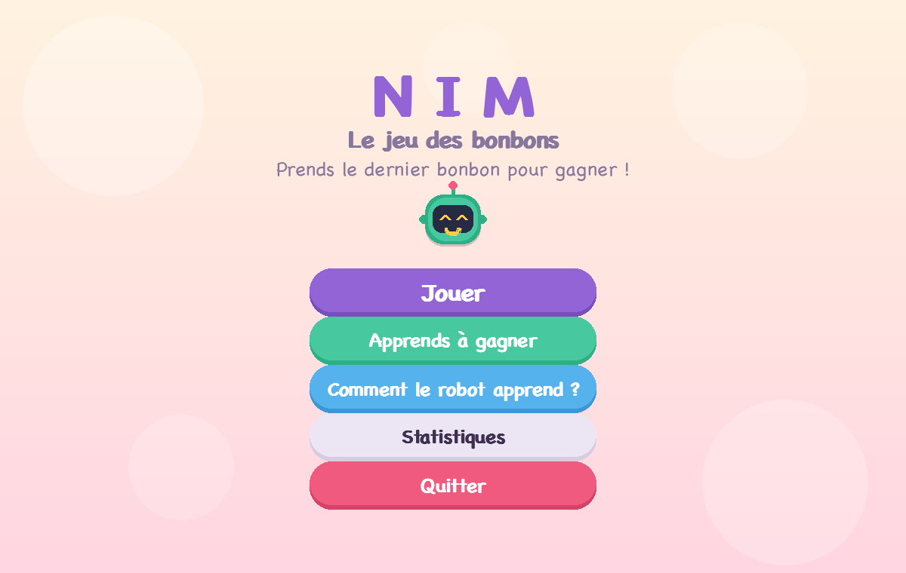
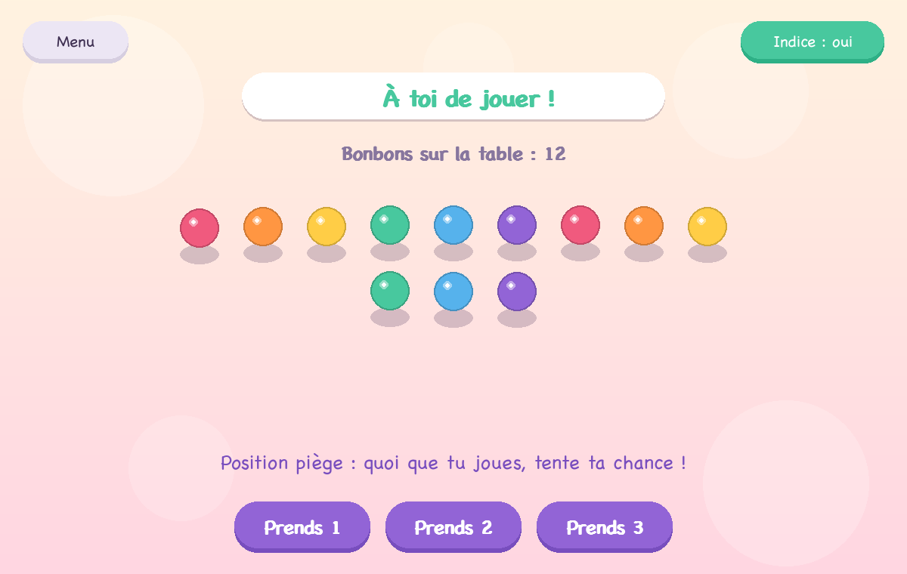
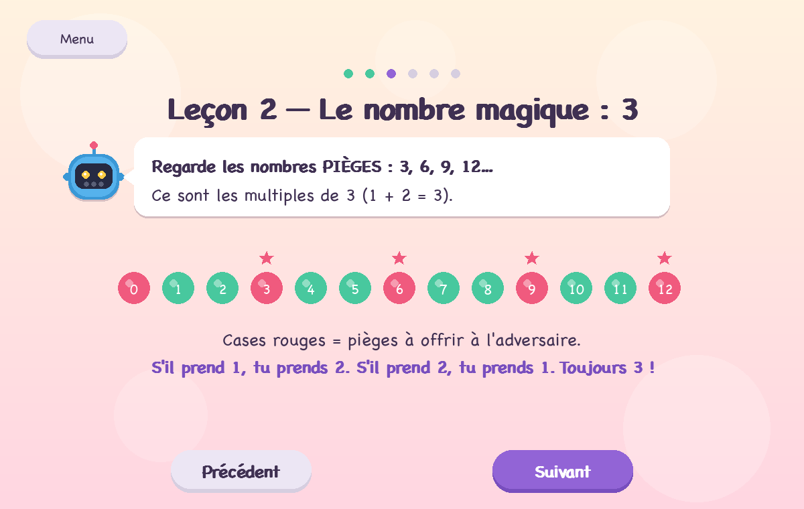
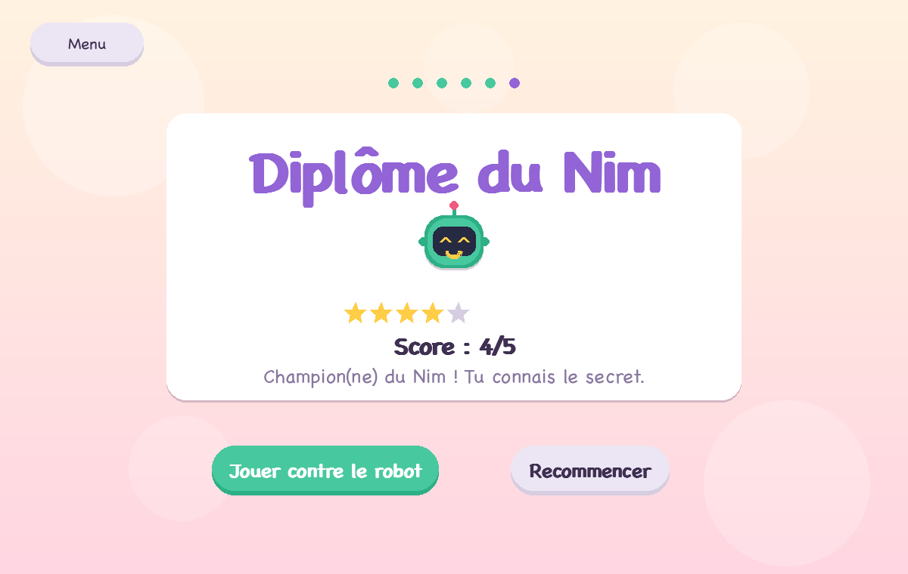
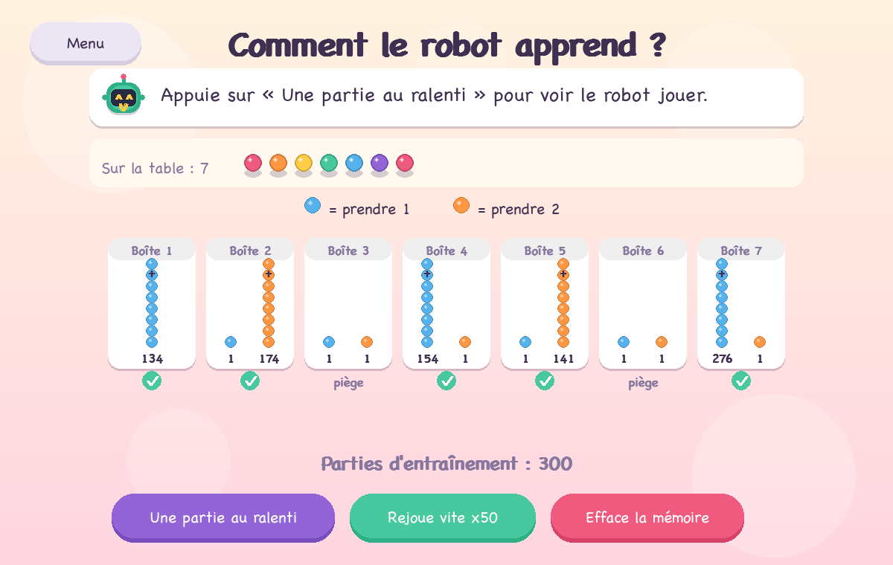

# 🍬 Nim — Le jeu des bonbons

Un jeu du **Nim** coloré, pensé pour les enfants, avec une **intelligence
artificielle qui apprend toute seule** et deux volets pédagogiques : apprendre
*à gagner* (la stratégie) et comprendre *comment une IA apprend* (le machine
learning), le tout de façon visuelle et interactive.

[](https://github.com/antoninche/ia_jeu_de_nim/releases/latest)
[](https://github.com/antoninche/ia_jeu_de_nim/actions/workflows/release.yml)
[](https://www.python.org/)
[](LICENSE)

> La règle : sur la table, il y a des bonbons. Chacun son tour, on en prend
> **1, 2 (ou 3)**. Celui qui prend le **dernier bonbon gagne**.



---

## Télécharger et jouer

Aucune installation de Python n'est nécessaire : téléchargez l'application
depuis la [**dernière release**](https://github.com/antoninche/ia_jeu_de_nim/releases/latest).

| Système | Fichier | Comment lancer |
|---|---|---|
| Windows | `Nim-Windows.zip` | Décompresser, puis double-cliquer sur `Nim.exe`. |
| macOS (Apple Silicon) | `Nim-macOS.zip` | Décompresser, **clic droit** sur `Nim.app` puis *Ouvrir* (confirmation demandée la première fois, l'app n'étant pas signée). |

---

## Le jeu

| Jouer contre le robot | Apprendre la stratégie |
|---|---|
|  |  |

- **Trois modes** : Toi vs Toi, Toi vs Robot, Robot vs Robot.
- Réglages : difficulté du robot, nombre de bonbons, qui commence, règle du jeu
  (prendre 1-2 ou 1-2-3).
- Bouton **Indice** qui révèle le coup parfait pour apprendre en jouant.
- Statistiques conservées d'une partie à l'autre.

Raccourcis en jeu : `1` `2` `3` pour jouer, `I` pour l'indice, `Échap` pour le menu.

---

## Deux volets pédagogiques

### Apprends à gagner — l'École du Nim

Un tutoriel guidé par un robot-professeur qui enseigne **le secret
mathématique** pour gagner : toujours laisser à l'adversaire un nombre de
bonbons **multiple de 3**. Il enchaîne des leçons animées (le but, le nombre
magique, la règle d'or), un **entraînement noté** avec un coach, puis un diplôme.



### Comment le robot apprend — l'IA en direct

L'IA n'a pas de cerveau magique : elle apprend comme la célèbre machine
**MENACE** de Donald Michie (1961), avec de simples **boîtes et perles de
couleur** :

1. **Une boîte par situation** (« il reste 1 bonbon », « il reste 2 bonbons »…).
2. **Des perles = des choix** (bleu = prendre 1, orange = prendre 2, vert =
   prendre 3). Pour jouer, le robot pioche une perle au hasard dans la bonne
   boîte : plus une couleur est nombreuse, plus elle sort souvent.
3. **On récompense, on punit** : à la fin de la partie, on **ajoute** une perle
   pour chaque coup gagnant et on **retire** une perle pour chaque coup perdant.

Après des centaines de parties, les bonnes perles deviennent majoritaires : le
robot « sait » jouer. La scène le montre en direct — une partie au ralenti, puis
un entraînement accéléré où l'on voit les boîtes converger.



Le Nim possède une stratégie parfaite connue (les positions perdantes sont les
multiples de `max_retrait + 1`). L'intérêt : l'IA **redécouvre cette règle seule**,
par essais et erreurs, sans qu'on la lui explique.

---

## Jouer depuis les sources

```bash
python3 -m venv .venv
source .venv/bin/activate        # Windows : .venv\Scripts\activate
pip install -r requirements.txt

python sources/jeu_nim.py        # version graphique
python sources/nim_console.py    # version terminal
```

## Construire l'exécutable

```bash
pip install pyinstaller
python build.py                  # produit dist/Nim.exe, dist/Nim.app ou dist/Nim
```

La publication des exécutables Windows et macOS est automatisée : pousser un tag
`vX.Y.Z` déclenche le workflow [`release.yml`](.github/workflows/release.yml) qui
construit les deux applications et crée la Release.

---

## Architecture du code

| Fichier | Rôle |
|---|---|
| [`sources/ia.py`](sources/ia.py) | Le cerveau : apprentissage par renforcement (boîtes et perles). |
| [`sources/game_logic.py`](sources/game_logic.py) | Les règles pures du Nim (états, coups valides, gagnant). |
| [`sources/jeu_nim.py`](sources/jeu_nim.py) | Le jeu graphique complet (toutes les scènes). |
| [`sources/ecole_nim.py`](sources/ecole_nim.py) | L'École du Nim : tutoriel éducatif interactif. |
| [`sources/explication_ia.py`](sources/explication_ia.py) | La scène « Comment le robot apprend ? ». |
| [`sources/theme.py`](sources/theme.py) | Palette, polices et utilitaires de dessin. |
| [`sources/widgets.py`](sources/widgets.py) | Boutons, mascotte robot, bonbons, confettis. |
| [`sources/nim_console.py`](sources/nim_console.py) | Version texte pour le terminal. |

## Dépendances

- Python 3.8 ou plus
- [pygame](https://www.pygame.org/) 2.5 ou plus (voir `requirements.txt`)

## Licence

Distribué sous licence MIT — voir [LICENSE](LICENSE).
